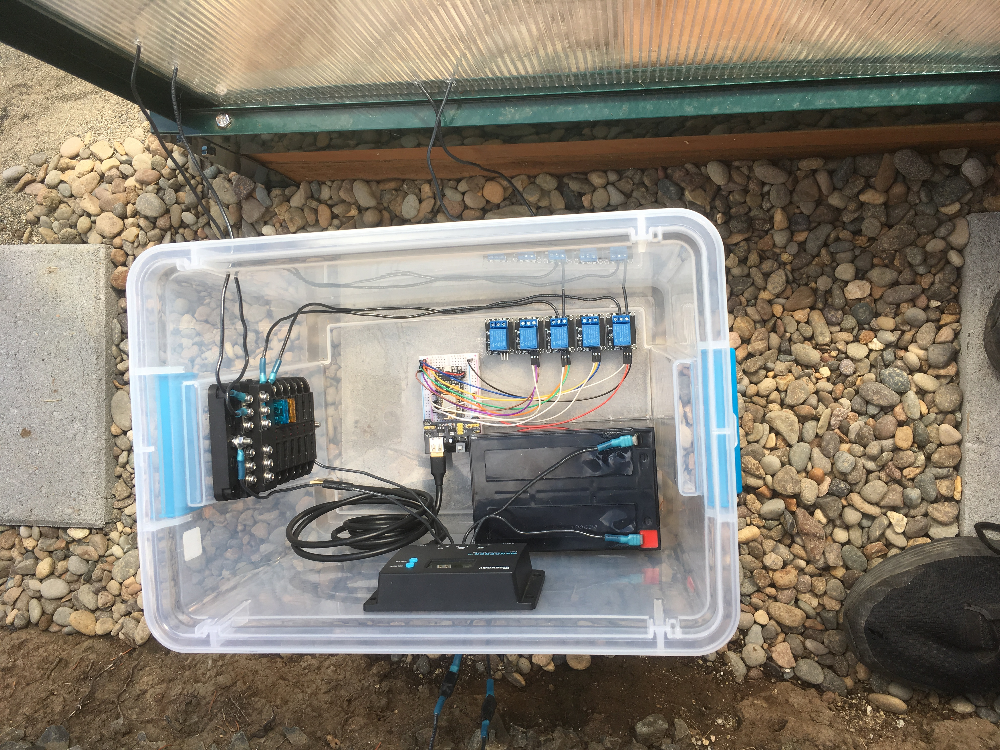
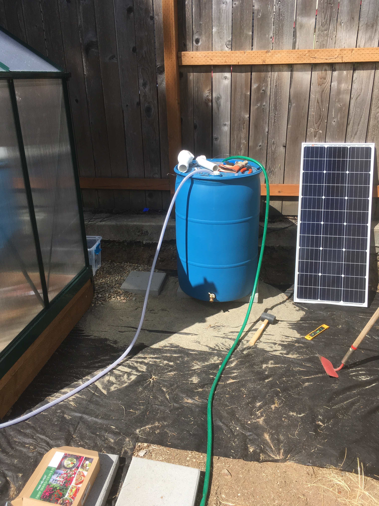

# smart_greenhouse
How to connect a greenhouse to a website

# The Big Picture:
-Connect a wifi chip to a greenhouse and a website so they can communicate
-Allows for remote access to a greenhouse from anywhere in the world
-This idea can be expanded to work for any IOT device

# Photos

# ESP8266 NodeMCU: C++ (Arduino IDE)

https://en.wikipedia.org/wiki/NodeMCU

* This wifi chip is center of this project
* Connects the greenhouse hardware and a personal website 
* Allows for 2-way communication

# Website: HTML/CSS/PHP/SQL
- First set up a web-server, either locally or have it hosted
- Must be able to run PHP on the server and run a SQL database
- Then place the following files into the server file structure as you see fit

## The Website Files:
* greenhouse_interface.php - allows the user to modify database - dependent on change_data.php
* change_data.php - factors out some of the change database logic
* device_interact.php - accepts http request from esp8266 device and responds

## Drawbacks/Room to Improve:
- Does not utilize HTTPS
- Integrating a sim-card and cell service would improve any connectivity issues
- If you have any ideas how this project can be improved please contact me via chriswycoff.com

